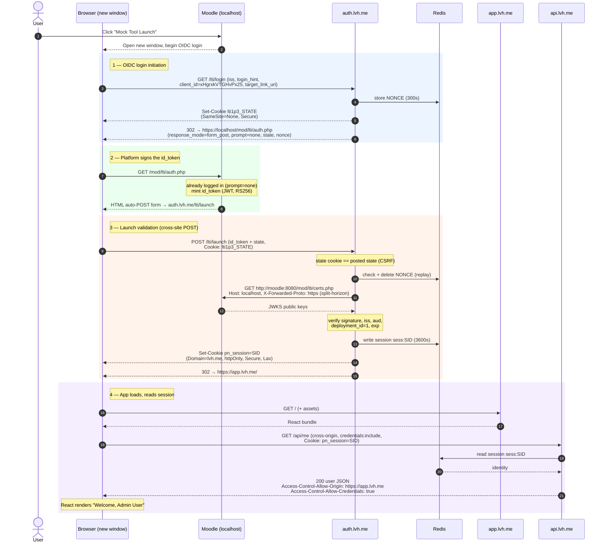

# Launch flow — click to rendered UI

What happens when a user clicks the **Mock Tool Launch** activity in Moodle, traced
through this lab's actual services and URLs. It's an LTI 1.3 (OpenID Connect) launch
followed by the tool's own session hand-off.

## Registered config (grounds the URLs)

| | Value |
|---|---|
| Issuer (`iss`) | `https://localhost` |
| Client ID | `xHgrxkVTGHvPx25` |
| Deployment ID | `1` |
| Moodle auth endpoint | `https://localhost/mod/lti/auth.php` |
| Moodle keyset — browser / **server** | `https://localhost/mod/lti/certs.php` / **`http://moodle:8080/mod/lti/certs.php`** |
| Tool login init | `https://auth.lvh.me/lti/login` |
| Tool redirect / launch | `https://auth.lvh.me/lti/launch` |
| App UI | `https://app.lvh.me/` |
| Session API | `https://api.lvh.me/api/me` |

## Sequence

## The mechanism at each boundary

| Boundary | Mechanism | Why it's needed |
|---|---|---|
| launch POST back (2 → 3) | state cookie `SameSite=None; Secure` | the launch returns as a **cross-site POST** from Moodle; a Lax cookie wouldn't be sent |
| signature check (3) | split-horizon `http://moodle:8080` + `Host: localhost` + `X-Forwarded-Proto: https` | the container can't reach `https://localhost`; Moodle 303-redirects unless the forwarded headers say it's already https |
| auth → app (3 → 4) | `pn_session` cookie `Domain=lvh.me`, `SameSite=Lax`, `httpOnly` | shared across `*.lvh.me`, survives refresh, unreadable by JS |
| app → api (4) | cross-origin CORS + `credentials:'include'` | `app` and `api` are different **origins** but the same **site** |

**Refresh** just re-runs step 4 — the cookie persists and Redis still holds the session, so no re-launch is needed. **Logout** (`POST https://api.lvh.me/api/logout`) deletes `sess:SID` from Redis and expires the cookie.
